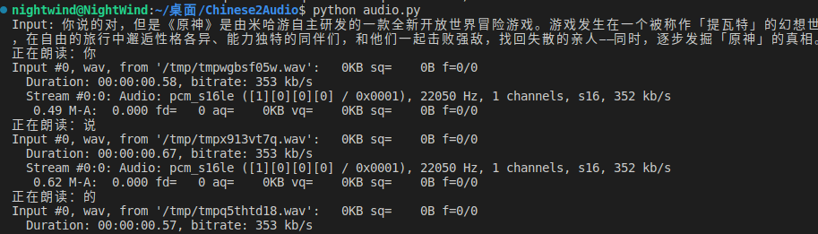

# Chinese2Audio
~~非常抽象的~~语音合成实现

<h2>效果截图(真的很抽象)</h2></p>
</p>

<h2>（一）环境要求</h2>
Python 3.x即可

<h2>（二）安装依赖</h2>
使用如下命令安装pypinyin和pydub</p>
```pip install pypinyin pydub
```
</p>
<h2>（三）Enjoy it!</h2>
克隆本仓库，然后进入<code>Chinese2Audio</code>目录，执行如下命令：</p>
```python audio.py
```
</p></p>
<strong>目前仅支持中文发音，数字/英文/数学符号发音暂不支持</strong>
